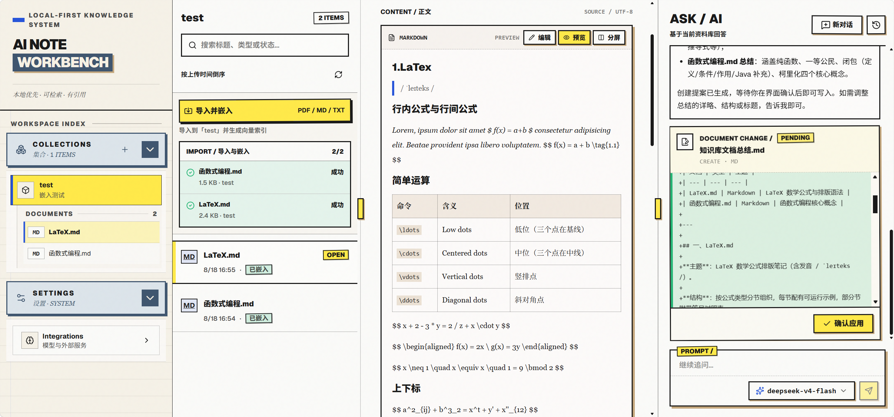
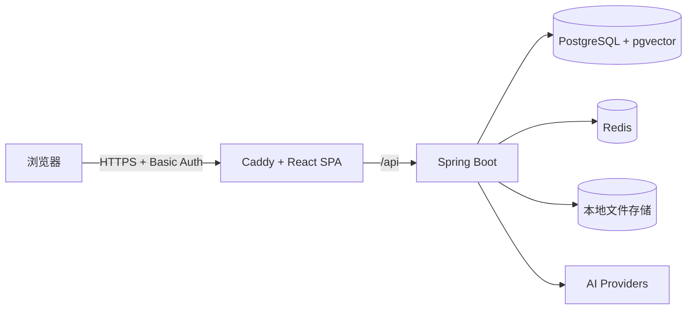

# AI Note Workbench

> 本地优先的 AI 知识库工作台，面向个人笔记、文档检索、RAG 问答与 AI 辅助写作。

[](https://github.com/grapeless/ai-note-workbench/actions/workflows/build.yml)
[](LICENSE)



## 项目状态

> [!IMPORTANT]
> 项目仍处于早期开发阶段，数据结构、配置和交互可能发生变化。当前定位为单用户、本地优先的研究型工具，尚未提供应用级用户体系。维护者的生产部署通过 Caddy Basic Auth 提供入口保护，但它不等同于多用户权限管理。

AI Note Workbench 希望把文档管理、知识库检索和 AI 协作放在同一个工作台中：原始文件保存在本地存储，结构化数据与向量索引由 PostgreSQL 和 pgvector 管理，对话状态由 Redis 辅助持久化，模型请求则通过可配置的 AI Provider 发出。

## 核心能力

- **知识库与文档管理**：创建知识集合，导入、查看、更新和删除文档。
- **多格式文档处理**：支持 PDF、Markdown 和 TXT；Markdown/TXT 可编辑，PDF 可在浏览器中预览。
- **RAG 索引流水线**：完成文档读取、切分、向量化和 pgvector 入库。
- **流式知识库问答**：基于当前知识集合进行 SSE 流式对话，并保留多轮会话历史。
- **引用溯源**：回答可关联原始文档位置，支持从引用返回来源内容。
- **可控 AI 写作**：AI 先生成文档变更提案，由用户确认后再写入文件。
- **任务取消**：支持取消正在生成的 AI 响应。
- **多 Provider 配置**：对话支持 DeepSeek、DashScope，嵌入支持 SiliconFlow、DashScope。

## 技术栈

| 层级 | 技术 |
| --- | --- |
| 前端 | React、TypeScript、Vite、Tailwind CSS、Base UI、Zustand |
| 后端 | Java 21、Spring Boot、Spring AI、MyBatis、Flyway |
| 数据 | PostgreSQL、pgvector、Redis、本地文件存储 |
| 部署 | Docker、Docker Compose、Caddy、GitHub Actions、腾讯云 TCR |

## 架构概览



开发环境中由 Vite 将 `/api` 请求代理到本地后端；容器环境中由 Caddy 提供静态页面、自动 HTTPS、Basic Auth 和相同的反向代理。

## 本地开发

### 环境要求

- Node.js 22+
- npm
- JDK 21
- Maven 3.9+
- Docker 与 Docker Compose
- 所使用 AI Provider 的 API Key

### 1. 克隆项目

```bash
git clone https://github.com/grapeless/ai-note-workbench.git
cd ai-note-workbench
```

### 2. 启动 PostgreSQL 与 Redis

复制环境变量示例并替换数据库、Redis 密码：

```bash
cp .env.example .env
docker compose up -d postgres redis
```

Windows PowerShell 可以使用：

```powershell
Copy-Item .env.example .env
docker compose up -d postgres redis
```

### 3. 配置后端

新建 `backend/src/main/resources/application-local.yml`。该文件已被 Git 忽略，不应提交真实密码或 API Key。

```yaml
spring:
  datasource:
    url: jdbc:postgresql://127.0.0.1:5432/note_workbench
    username: note_workbench_user
    password: <POSTGRES_PASSWORD>
  data:
    redis:
      host: 127.0.0.1
      port: 6379
      password: <REDIS_PASSWORD>

app:
  ai:
    chat:
      providers:
        deepseek:
          api-key: <DEEPSEEK_API_KEY>
        dashscope:
          api-key: <DASHSCOPE_CHAT_API_KEY>
    embedding:
      providers:
        siliconflow:
          api-key: <SILICONFLOW_API_KEY>
        dashscope:
          api-key: <DASHSCOPE_EMBEDDING_API_KEY>
```

模型地址、模型列表、向量维度和表名统一维护在 `application.yml`；本地文件只保存环境相关的连接信息和密钥。

### 4. 启动后端

```bash
cd backend
mvn spring-boot:run
```

默认后端地址为 `http://localhost:8080`，OpenAPI 页面为 `http://localhost:8080/swagger-ui/index.html`。Flyway 会在启动时初始化或更新数据库结构。

### 5. 启动前端

```bash
cd frontend
npm ci
npm run dev
```

默认访问地址为 `http://localhost:5173`。Vite 会把 `/api` 请求转发到 `http://localhost:8080`。

## 容器部署说明

当前根目录的 `docker-compose.yml` 服务于项目维护者的生产部署，前后端镜像来自腾讯云 TCR。前端镜像运行 Caddy，负责 HTTPS、Basic Auth、React 静态资源和 `/api` 反向代理。通用的开源镜像分发与 Compose 部署方案仍在整理中；在此之前，外部使用者建议按“本地开发”章节从源码运行。

生产发布由 GitHub Actions 完成：GitHub Runner 构建前后端镜像并推送到 TCR，随后通过 SSH 让服务器只拉取并更新发生变化的应用容器。PostgreSQL 和 Redis 正常运行时不会随应用部署重启。当前维护者部署同时支持正式域名入口和使用短期证书的临时公网 IP 入口，配置与验证方法见 [腾讯云生产部署指南](docs/deployment/tencent-cloud.md)。

## 项目结构

```text
ai-note-workbench/
├─ frontend/                 React 前端
├─ backend/                  Spring Boot 后端
├─ docs/                     项目文档与图片
├─ storage/                  本地运行时文件目录
├─ .github/workflows/        CI/CD 工作流
├─ .env.example              Compose 环境变量示例
└─ docker-compose.yml        当前生产 Compose 配置
```

## 路线图

- 完善 RAG 检索、过滤与查询增强。
- 完善 Provider 集成与模型配置界面。
- 降低本地启动时的 Provider 配置门槛。
- 增加 RAG 评估、自动化测试与可观测能力。
- 探索多模态文档和更多通用 Agent 能力。
- 整理通用的开源容器部署方案。

## 参与贡献

请勿在 Issue、日志、截图、提交或 Pull Request 中包含 API Key、数据库密码、服务器地址等敏感信息。

## License

本项目基于 [MIT License](LICENSE) 开源。
